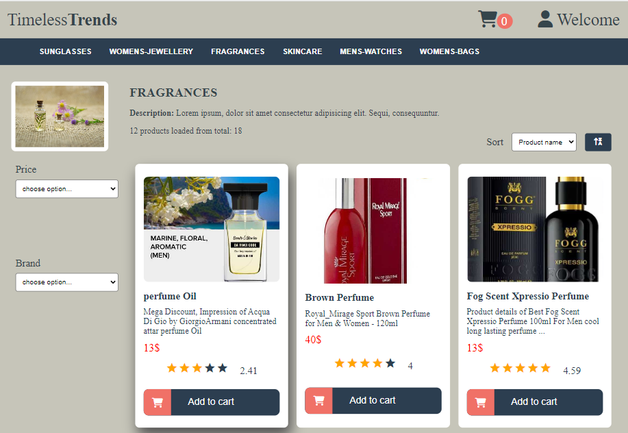
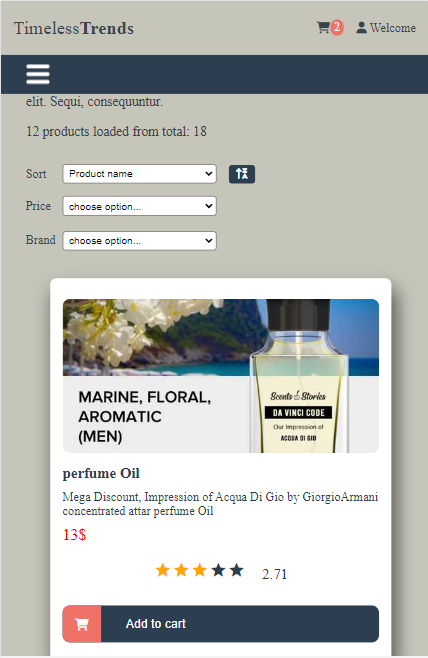
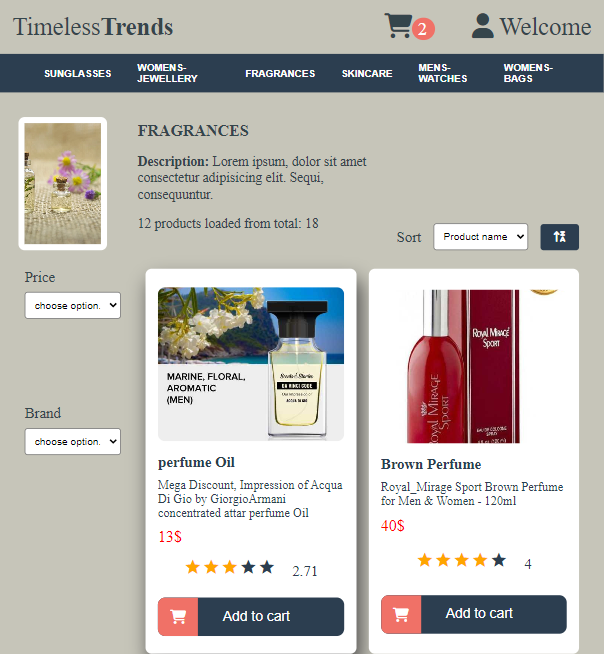

# Timeless Trends

This project is generated with Angular version 16.1.4. The project is about listing products by categories. Each product has a title, an image, and a short description. Users can add products to the cart, rate the products, filter products, and sort them by different options.

## Description: 
1. Header:
- whenever customer scrolls down to the page the
  header remain visible
- header has just a couple of categories. Clicking on a category there are
  loaded different set of products depending on the category selected
- When a customer opens the page, the first category should
  is loaded by default.
2. Product counter – small section showing how many products are currently displayed in the
  product grid. (x out of y).
3. Product Grid
  a. Contains a set of product tiles positioned in a grid-like structure.
  b. The number of products loaded first are nine and user can click load more button to load nine more products. If there are no more porducts to load, load more button is       disabled.
  c. Product tile - each product tile should contain:
        i. Image of the product
        ii. Name of the product
        iii. Short description
        iv. Price (some products should have discounted price)
        v. Ratings ‘stars’.
        vi. Add to cart button – a success alert is displayed on click
4. Sorting mechanism:
    a. sort by product name: Alphabetical a-z, Alphabetical z-a
    b.sort by price: Price ascending, Price descending.
5. Filtering mechanism:
  a.filter by price range
  b. filter by brand

 

## Install dependencies: 

`npm install`

## Run project:

Run `ng serve` for a dev server. 
Navigate to `http://localhost:4200/`. The application will automatically reload if you change any of the source files.

## Data source:
 DummyJSON: https://dummyjson.com/docs/products
## Note:
DummyJSON returns categories with 5 products each. To implement the logic for loading more products, I simulated different numbers of products for each collection by multiplying these 5 products. This allows users to experience various scenarios where more than 5 products are needed to be loaded in order to see all the available items.
