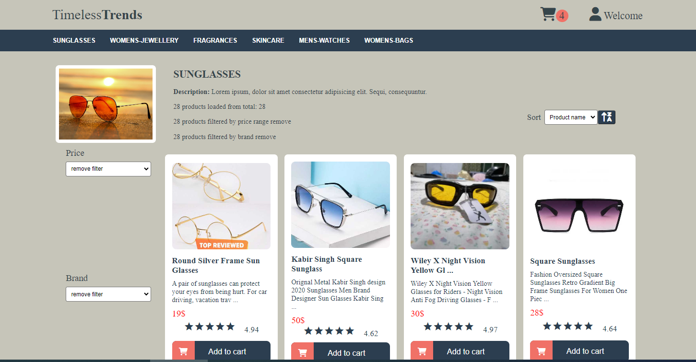

# Timeless Trends

This project is generated with Angular version 16.1.4. The project is about listing products by categories. Each product has a title, an image, and a short description. Users can add products to the cart, rate the products, filter products, and sort them by different options

## run project:

Run `ng serve` for a dev server. 
Navigate to `http://localhost:4200/`. The application will automatically reload if you change any of the source files.

## Data source:
 DummyJSON: https://dummyjson.com/docs/products
## Note:
DummyJSON returns categories with 5 products each. To implement the logic for loading more products, I simulated different numbers of products for each collection by multiplying these 5 products. This allows users to experience various scenarios where more than 5 products are needed to be loaded in order to see all the available items.
